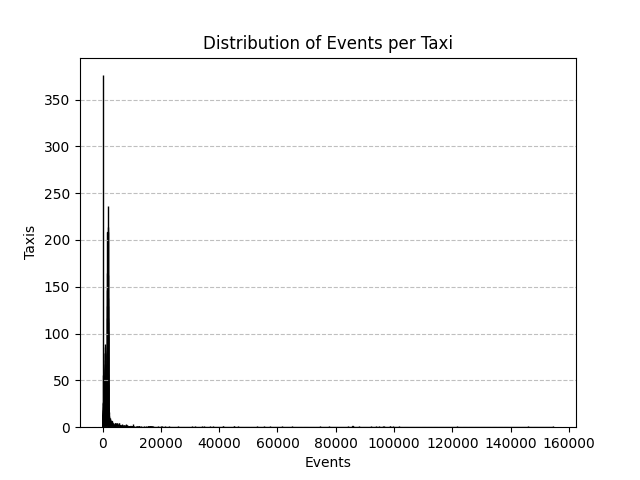

# Input Data Analysis Report
The input dataset contains a total of 17,662,984 events from 10,357 taxis. The number of events recorded for individual taxis varies significantly. While the majority of taxis have a moderate number of events, a small subset of taxis has an exceptionally high number of events.

## Key Statistics
|||
|---|---|
| **Number of taxis** | 10,357 |
| **Total number of events** | 17,662,984 |
| **Maximum events for a single taxi** | 154,688 |
| **Minimum events for a single taxi** | 0 |
| **Average events per taxi** | 1,705.42 |
| **Standard deviation of events** | 4,729.41 |
| **Median events per taxi** | 1,397 |

## Event Distribution
The distribution of events per taxi is visualized in the histogram below:

