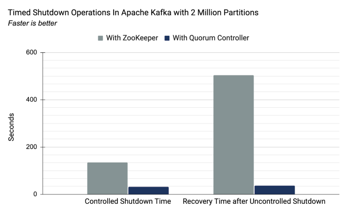

# KRaft: Apache Kafka Without ZooKeeper
Apache Kafka Raft (KRaft) is the consensus protocol that was introduced in KIP-500 to remove Apache Kafka’s dependency on ZooKeeper for metadata management.
This greatly simplifies Kafka’s architecture by consolidating responsibility for metadata into Kafka itself, rather than splitting it between two different systems: ZooKeeper and Kafka.
KRaft mode makes use of a new quorum controller service in Kafka which replaces the previous controller and makes use of an event-based variant of the Raft consensus protocol.

## Benefits of Kafka’s new quorum controller
1. KRaft enables right-sized clusters, meaning clusters that are sized with the appropriate number of brokers and compute to satisfy a use case’s throughput and latency requirements, with the potential to scale up to millions of partitions
2. Improves stability, simplifies the software, and makes it easier to monitor, administer, and support Kafka
3. Allows Kafka to have a single security model for the whole system
4. Unified management model for configuration, networking setup, and communication protocols
5. Provides a lightweight, single-process way to get started with Kafka
6. Makes controller failover near-instantaneous

## How it works
The quorum controllers use the new KRaft protocol to ensure that metadata is accurately replicated across the quorum.
The quorum controller stores its state using an event-sourced storage model, which ensures that the internal state machines can always be accurately recreated.
The event log used to store this state (also known as the metadata topic) is periodically abridged by snapshots to guarantee that the log cannot grow indefinitely.
The other controllers within the quorum follow the active controller by responding to the events that it creates and stores in its log.
Thus, should one node pause due to a partitioning event, for example, it can quickly catch up on any events it missed by accessing the log when it rejoins.
This significantly decreases the unavailability window, improving the worst-case recovery time of the system.

The event-driven nature of the KRaft protocol means that, unlike the ZooKeeper-based controller, the quorum controller does not need to load state from ZooKeeper before it becomes active.
When leadership changes, the new active controller already has all of the committed metadata records in memory.
What’s more, the same event-driven mechanism used in the KRaft protocol is used to track metadata across the cluster.
A task that was previously handled with RPCs now benefits from being event-driven as well as using an actual log for communication.

Source: [https://developer.confluent.io/learn/kraft/](https://developer.confluent.io/learn/kraft/)
